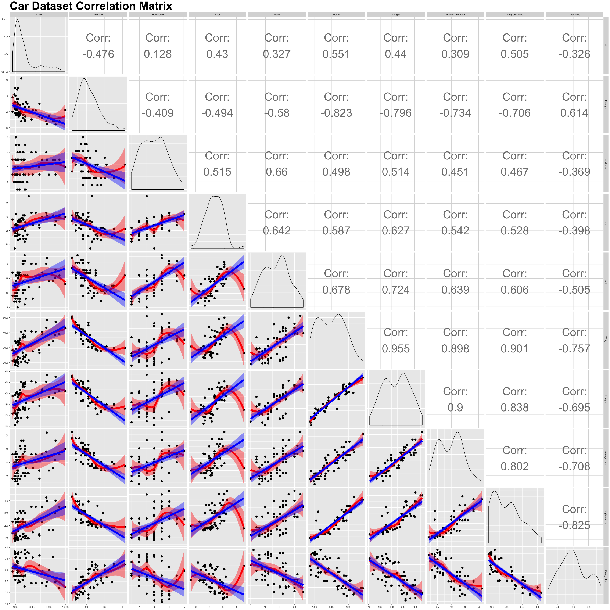

---
title: <center><h1>2018R1 High-Dimensional Data Analysis (STAT5103) Assignment 2</h1></center><br />
author: <center>Yiu Chung WONG 1155017920</center>
output:
  html_document:
    keep_md: yes
  pdf_document: default
  word_document: default
--- 
<br />
<br />


#Car Data


```r
car <- read.csv(data_url, header = FALSE, sep = "\t", na.strings = c("NaN", "Nan"))
car <- car[,-c(3, 4, 13)]
names <- c("Price", "Mileage", "Headroom", "Rear", "Trunk", "Weight", "Length", "Turning_diameter", "Displacement", "Gear_ratio")
names(car) <- names
summary(car)
```

```
##      Price          Mileage         Headroom          Rear           Trunk           Weight    
##  Min.   : 3291   Min.   :12.00   Min.   :1.500   Min.   :18.50   Min.   : 5.00   Min.   :1760  
##  1st Qu.: 4319   1st Qu.:18.00   1st Qu.:2.500   1st Qu.:25.00   1st Qu.:10.25   1st Qu.:2250  
##  Median : 5092   Median :20.00   Median :3.000   Median :27.00   Median :14.00   Median :3175  
##  Mean   : 6192   Mean   :21.30   Mean   :2.986   Mean   :26.82   Mean   :13.74   Mean   :3011  
##  3rd Qu.: 6332   3rd Qu.:24.75   3rd Qu.:3.500   3rd Qu.:29.00   3rd Qu.:16.00   3rd Qu.:3652  
##  Max.   :15906   Max.   :41.00   Max.   :5.000   Max.   :37.50   Max.   :23.00   Max.   :4840  
##      Length      Turning_diameter  Displacement     Gear_ratio   
##  Min.   :142.0   Min.   :32.0     Min.   : 79.0   Min.   :2.190  
##  1st Qu.:170.0   1st Qu.:36.0     1st Qu.:119.0   1st Qu.:2.730  
##  Median :192.5   Median :40.0     Median :196.0   Median :2.955  
##  Mean   :188.1   Mean   :39.8     Mean   :197.3   Mean   :3.018  
##  3rd Qu.:203.8   3rd Qu.:43.0     3rd Qu.:245.2   3rd Qu.:3.353  
##  Max.   :233.0   Max.   :51.0     Max.   :425.0   Max.   :3.890
```
<br />

###1. Plot the correlation chart.

```r
my.lm <- function(data, mapping, ...){
  p <- ggplot(data = data, mapping = mapping) + 
    geom_point(size = 3) + 
    geom_smooth(method = loess, fill = "red", color = "red", size = 3, ...) +
    geom_smooth(method = lm, fill = "blue", color = "blue", size = 3, ...)
  p
}


g <- ggpairs(
        car, 
        columns = 1:10 ,
        upper = list(continuous = wrap("cor", size = 14)),
        lower = list( continuous = my.lm)
        )

g <- g + ggtitle("Car Dataset Correlation Matrix") + 
        theme(plot.title = element_text(lineheight = .8,
                                        face = "bold",
                                        size = 40), 
              axis.title.x = element_text(size = 20))

g
```


<br />

###2. Based on your correlation chart, summarize your findings. <br />

* Predictors are either highly skewed or bimodal. Although OLS regression does not assume normality in the predictors, non-normal data **MAY** cause the relationship between them and the target variable to be non-linear. Looking at the leftmost column and comparing loess curves (red) to the linear regression lines (blue) of all the graphs, the relationships between these predictors and `Price` are relatively linear, so no linear transformations is required prior to modeling.
<br />

* In the same column, most of the points are centered around the lower price values among all graphs. This is likely due to the fact that there are many more low-cost cars then there are expensive ones (indicated by the top left density graph). Now look at the regression lines and their confidence intervals (both in blue), the confidence intervals get wider as price increases. This indicates that heteroskedasticity may exist in the residual terms and might lead to biased standard error, which in-turns lead to unreliable confidence intervals and hypothesis test of the regression coefficients.
<br />

* If we take a look at `Price`:

```r
sum_stat <- psych::describe(car$Price)
sum_stat
```

```
##    vars  n    mean      sd median trimmed     mad  min   max range skew kurtosis     se
## X1    1 74 6192.28 2938.06 5091.5  5647.5 1417.37 3291 15906 12615 1.62      1.7 341.54
```
The standard deviation of `Price` is surprisingly large at 2938.06; Skewness is 1.62, which means the distribution is highly skewed towards high prices. Although OLS regression does not assume normality for the target variable, one must be caution with normality of the residuals.
<br />

* Many predictors are highly correlated to each other. For example, `Weight` and `Length` have correlation 0.955; `Displacement` and `Gear_ratio` have correlation -0.825. Collinearity can also hide amongst the whole set of predictors instead of just two. Therefore, we are not safe from  multicollinearity simply because other predictors are of lower correlation. Other metrics such as Variance Inflation Factor is better at simultaneously evaluating one predictor against all others. One must be caution of multicollinearity in this dataset because they reduces the precision of the estimate coefficients (by weakening statistical power), as well as making coefficients sensitive (varies greatly) under the presence of other predictors in the model. 
<br />


###3. Conduct a regression analysis using $X_{1}$ as the dependent variable and theothers as independent variables.<br />       

```r
full_model <- lm(data = car, Price ~ .)
```
<br />

####a. State the model
$$
\begin{align*}
\mathrm{Price} = \beta_{0} 
    &+ \beta_{1}\;  \mathrm{Mileage} \\
    &+ \beta_{2}\;  \mathrm{Headroom}    \\
    &+ \beta_{3}\;  \mathrm{Rear} \\
    &+ \beta_{4}\;  \mathrm{Trunk} \\
    &+ \beta_{5}\;  \mathrm{Weight}   \\
    &+ \beta_{6}\;  \mathrm{Length}  \\
    &+ \beta_{7}\;  \mathrm{Turning\;diameter}  \\
    &+ \beta_{8}\;  \mathrm{Displacement}  \\
    &+ \beta_{9}\;  \mathrm{Gear\;ratio}  \\
    &+ \epsilon
\end{align*}
$$


####b. What is the regression equation?

$$
\begin{align*}
\mathrm{\hat{Price}} = 15870.83 
    &+ -38.37\;  \mathrm{Mileage} \\
    &+ -1023.31\;  \mathrm{Headroom}    \\
    &+ 290.77\;  \mathrm{Rear} \\
    &+ 74.22\;  \mathrm{Trunk} \\
    &+ 7.29\;  \mathrm{Weight}   \\
    &+ -113.78\;  \mathrm{Length}  \\
    &+ -518.6\;  \mathrm{Turning\;diameter}  \\
    &+ 4.51\;  \mathrm{Displacement}  \\
    &+ 1519.82\;  \mathrm{Gear\;ratio}  
\end{align*}
$$
<br />


####c. Test the overall utility of the model with $\alpha$ = 0.05.

```r
null_model <- lm(data = car, Price~1)
anova(null_model, full_model)
```

```
## Analysis of Variance Table
## 
## Model 1: Price ~ 1
## Model 2: Price ~ Mileage + Headroom + Rear + Trunk + Weight + Length + 
##     Turning_diameter + Displacement + Gear_ratio
##   Res.Df       RSS Df Sum of Sq      F   Pr(>F)    
## 1     73 630150315                                 
## 2     64 242146559  9  3.88e+08 11.395 2.02e-10 ***
## ---
## Signif. codes:  0 '***' 0.001 '**' 0.01 '*' 0.05 '.' 0.1 ' ' 1
```
<br />


####d. Give the parameter table and based on the p-values, which independent variables are useful for the prediction of the price of the car?

```r
summary(full_model)$coef
```

```
##                      Estimate  Std. Error    t value     Pr(>|t|)
## (Intercept)      15870.833854 6320.654599  2.5109478 1.457709e-02
## Mileage            -38.374292   70.298756 -0.5458744 5.870500e-01
## Headroom         -1023.305458  367.705348 -2.7829496 7.072251e-03
## Rear               290.768774  101.420686  2.8669573 5.604350e-03
## Trunk               74.218332   91.940843  0.8072401 4.225182e-01
## Weight               7.286075    1.377220  5.2904238 1.584341e-06
## Length            -113.775044   40.049719 -2.8408450 6.027366e-03
## Turning_diameter  -518.599196  128.571205 -4.0335563 1.489200e-04
## Displacement         4.507703    6.777524  0.6650959 5.083789e-01
## Gear_ratio        1519.821653  910.493471  1.6692285 9.995712e-02
```

```r
#Coefficients with p-value <= .05
summary(full_model)$coef[summary(full_model)$coef[,4] <= .05, 4] %>%
        formatC(., format = "e", digits = 2) %>%
        data.frame("Sigificant Coefficients" = .)
```

```
##                  Sigificant.Coefficients
## (Intercept)                     1.46e-02
## Headroom                        7.07e-03
## Rear                            5.60e-03
## Weight                          1.58e-06
## Length                          6.03e-03
## Turning_diameter                1.49e-04
```
<br />

####e. What is the adjusted *$R^2$*? Comment.
*$R^2$* increases as the number of predictor increase regardless of whether each predictor is useful or not; *$R^2$* will slowly approach one even if we dump in the kitchen sink. The adjusted *$R^2$* is used to offset such effect by penalising model with predictors that do a bad job in explaining variations in the target variable. 
Adjusted for the number of predictors, the portion of variation in `Price` explained by the predictors is 0.5616944. There are still close to half the variation that are not explained by the full model.

```r
summary(full_model)$adj.r.squared 
```

```
## [1] 0.5616944
```
<br />


###4. Use stepwise regression (the method discussed in class) for variable selection. For your final model,<br />

```r
step_model <- MASS::stepAIC(object = full_model, 
                            direction = "both",
                            trace = FALSE
                            )
```
<br />

####a. What is the AIC value?
When we fit a model with training data, we estimate the regression coefficients such that the training RSS (not test RSS) is as small as possible. Training error may decrease as more predictors are added, but test error may not. Hence we cannot use training RSS or *$R^2$* to perform model selection (from a set of models with varying number of predictors). 
The *Akaike Information Criterion* (AIC) is a technique to adjust the training error for different model sizes; since more predictors means lower training error which tends to underestimate the test error, AIC penalises model with higher number of predictors and favors parsimonious models.  

```r
extractAIC(step_model)[2]
```

```
## [1] 1125.575
```
<br />

####b. State the model
$$
\begin{align*}
\mathrm{Price} = \beta_{0} 
    &+ \beta_{1}\;  \mathrm{Headroom}    \\
    &+ \beta_{2}\;  \mathrm{Rear} \\
    &+ \beta_{3}\;  \mathrm{Weight}   \\
    &+ \beta_{4}\;  \mathrm{Length}  \\
    &+ \beta_{5}\;  \mathrm{Turning\;diameter}  \\
    &+ \beta_{6}\;  \mathrm{Gear\;ratio}  \\
    &+ \epsilon
\end{align*}
$$

<br />

####c. What is the regression equation?

$$
\begin{align*}
\mathrm{\hat{Price}} = 14237.48 
    &+ -884.16\;  \mathrm{Headroom}    \\
    &+ 315.58\;  \mathrm{Rear} \\
    &+ 7.84\;  \mathrm{Weight}   \\
    &+ -107.06\;  \mathrm{Length}  \\
    &+ -525.89\;  \mathrm{Turning\;diameter}  \\
    &+ 1186.51\;  \mathrm{Gear\;ratio}  \\
\end{align*}
$$
<br />

####d. Test the overall utility of the model with $\alpha$ = 0.05.

```r
anova(null_model, step_model)
```

```
## Analysis of Variance Table
## 
## Model 1: Price ~ 1
## Model 2: Price ~ Headroom + Rear + Weight + Length + Turning_diameter + 
##     Gear_ratio
##   Res.Df       RSS Df Sum of Sq      F    Pr(>F)    
## 1     73 630150315                                  
## 2     67 247111741  6 383038574 17.309 5.641e-12 ***
## ---
## Signif. codes:  0 '***' 0.001 '**' 0.01 '*' 0.05 '.' 0.1 ' ' 1
```
<br />

####e. Give the parameter table and based on the p-values,which independent variables are useful for the prediction of the price of the car?

```r
summary(step_model)$coef
```

```
##                      Estimate  Std. Error   t value     Pr(>|t|)
## (Intercept)      14237.477185 5255.525386  2.709049 8.558017e-03
## Headroom          -884.161551  326.532456 -2.707729 8.588688e-03
## Rear               315.577372   96.800784  3.260070 1.752350e-03
## Weight               7.843386    1.101419  7.121162 9.190067e-10
## Length            -107.060769   37.966187 -2.819898 6.312339e-03
## Turning_diameter  -525.889898  126.629408 -4.152984 9.491034e-05
## Gear_ratio        1186.514226  777.009115  1.527027 1.314615e-01
```

```r
summary(step_model)$coef[summary(step_model)$coef[,4] <= .05, 4] %>%
        formatC(., format = "e", digits = 2) %>%
        data.frame("Sigificant Coefficients" = .)
```

```
##                  Sigificant.Coefficients
## (Intercept)                     8.56e-03
## Headroom                        8.59e-03
## Rear                            1.75e-03
## Weight                          9.19e-10
## Length                          6.31e-03
## Turning_diameter                9.49e-05
```
<br />

####f. What is the adjusted *$R^2$*? Comment.

```r
summary(step_model)$adj.r.squared  
```

```
## [1] 0.572735
```
The adjusted *$R^2$* is 0.572735 which is a little higher then the full model's. 
stepAIC selects the model based on AIC. The goal is to find a parsimonious model with the smallest AIC by removing or adding predictors in the scope. Comparing to `full_model`, `step_model` contains fewer predictors. Hence, `step_model` is penalised less when calculating the adjusted *$R^2$*. 
