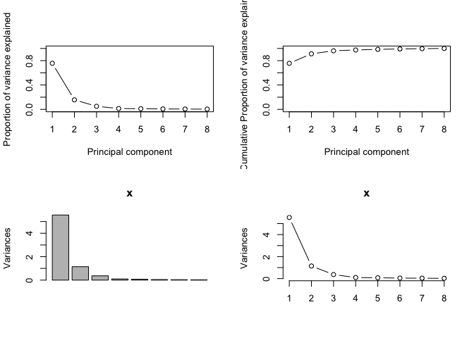
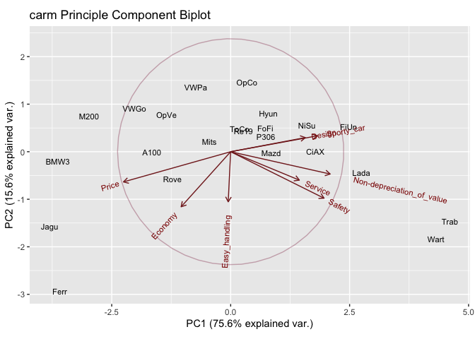
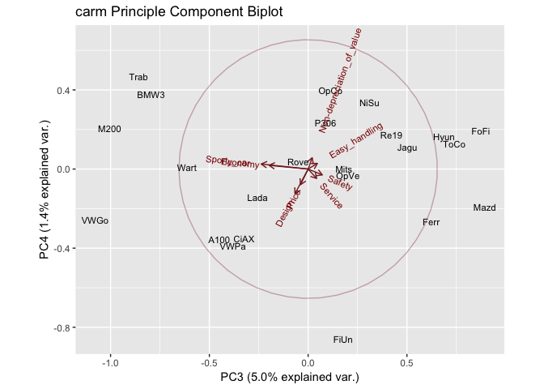

---
title: <center><h1>2018R1 High-Dimensional Data Analysis (STAT5103) Assignment 3</h1></center><br />
author: <center>Yiu Chung WONG 1155017920</center>
output:
  html_document:
    keep_md: yes
  pdf_document: default
  word_document: default
--- 
<br />
<br />


#Principal Component Analysis (PCA) on carm Car Dataset


```r
pc_car <- read.csv('carm.txt', header = FALSE, sep = '')
names <- c("Model", "Economy", "Service", "Non-depreciation_of_value", "Price", "Design", "Sporty_car", "Safety", "Easy_handling")
names(pc_car) <- names
rownames(pc_car) <- pc_car[,1]
pc_car <- pc_car[,-1]
summary(pc_car)
```

```
##     Economy         Service      Non-depreciation_of_value     Price           Design   
##  Min.   :2.100   Min.   :1.600   Min.   :1.600             Min.   :1.500   Min.   :1.3  
##  1st Qu.:2.600   1st Qu.:2.500   1st Qu.:2.200             1st Qu.:2.600   1st Qu.:2.9  
##  Median :3.100   Median :2.900   Median :3.200             Median :3.000   Median :3.2  
##  Mean   :3.291   Mean   :3.061   Mean   :3.152             Mean   :3.274   Mean   :3.2  
##  3rd Qu.:3.850   3rd Qu.:3.450   3rd Qu.:3.750             3rd Qu.:4.100   3rd Qu.:3.6  
##  Max.   :5.300   Max.   :4.700   Max.   :5.500             Max.   :5.900   Max.   :4.8  
##    Sporty_car        Safety      Easy_handling  
##  Min.   :1.100   Min.   :1.400   Min.   :1.800  
##  1st Qu.:3.050   1st Qu.:2.800   1st Qu.:2.400  
##  Median :3.300   Median :3.200   Median :2.700  
##  Mean   :3.465   Mean   :3.287   Mean   :2.787  
##  3rd Qu.:3.950   3rd Qu.:3.750   3rd Qu.:2.950  
##  Max.   :5.800   Max.   :5.900   Max.   :4.300
```
<br />

#Analyzing carm.txt dataset
carm.txt data sets comes with basic dataset with 8 variables. Using PCA, we are going to find linear combinations of the variables that both maximises variance and are mutually uncorrelated.

```r
head(pc_car)
```

```
##      Economy Service Non-depreciation_of_value Price Design Sporty_car Safety Easy_handling
## A100     3.9     2.8                       2.2   4.2    3.0        3.1    2.4           2.8
## BMW3     4.8     1.6                       1.9   5.0    2.0        2.5    1.6           2.8
## CiAX     3.0     3.8                       3.8   2.7    4.0        4.4    4.0           2.6
## Ferr     5.3     2.9                       2.2   5.9    1.7        1.1    3.3           4.3
## FiUn     2.1     3.9                       4.0   2.6    4.5        4.4    4.4           2.2
## FoFi     2.3     3.1                       3.4   2.6    3.2        3.3    3.6           2.8
```


###A. Compute the Principal Components. <br />


```r
#Principle Component using non-centered, non-scaled datas
pc_car_pca <- prcomp(pc_car)
names(pc_car_pca)
```

```
## [1] "sdev"     "rotation" "center"   "scale"    "x"
```

```r
pc_car_pca
```

```
## Standard deviations (1, .., p=8):
## [1] 2.3571850 1.0704267 0.6052965 0.3154203 0.2750905 0.2186714 0.1891948 0.1564734
## 
## Rotation (n x k) = (8 x 8):
##                                   PC1        PC2         PC3        PC4         PC5        PC6
## Economy                   -0.22074468 -0.5406128 -0.59342593  0.1091400 -0.03715014  0.2076344
## Service                    0.30597795 -0.2790384  0.12849793 -0.2740828  0.10755712 -0.6891689
## Non-depreciation_of_value  0.44346793 -0.2191251  0.06175501  0.3292515  0.40319081 -0.1158605
## Price                     -0.47767627 -0.2964806 -0.11642410 -0.4561908  0.01677775 -0.3512380
## Design                     0.33268483  0.1386958 -0.20025752 -0.7204073  0.36718744  0.4111211
## Sporty_car                 0.38569859  0.1557756 -0.71265406  0.1460579 -0.13023590 -0.2451503
## Safety                     0.41623018 -0.4565588  0.21554180 -0.1701540 -0.66939195  0.2419840
## Easy_handling             -0.01098606 -0.4919455  0.13974456  0.1648590  0.47363848  0.2397225
##                                   PC7          PC8
## Economy                   -0.43602713  0.245625524
## Service                   -0.47623487 -0.153492508
## Non-depreciation_of_value  0.30152838  0.613346794
## Price                      0.56452099  0.141161045
## Design                    -0.04250816  0.073078202
## Sporty_car                 0.31721979 -0.346516075
## Safety                     0.19039136 -0.002274241
## Easy_handling              0.18652925 -0.628146827
```

Above PCA output returns 8 variable loadings as rotation. The number of variable loadings in rotation is equal to number variables in the dataset. These are also the eigen vectors of the covariance matrix of the original dataset.

Each variable loadings also represent how to linearly combine the original dataset into a new dataset with orthogonal variables (Principal Components). Let's take a look at the first two Principle Components:

$$
\begin{align*}
y_1 = 
    & -0.2207447\;  \mathrm{Economy} \\
    &+ 0.3059779\;  \mathrm{Service}    \\
    &+ 0.4434679\;  \mathrm{Non_depreciation\_of\_value} \\
    & -0.4776763\;  \mathrm{Price} \\
    &+ 0.3326848\;  \mathrm{Design}   \\
    &+ 0.3856986\;  \mathrm{Sporty\_car}  \\
    &+ 0.4162302\;  \mathrm{Safety}  \\
    & -0.0109861\;  \mathrm{Easy\_handling}  
\end{align*}
$$

$$
\begin{align*}
y_2 = 
    & -0.5406128\;  \mathrm{Economy} \\
    & -0.2790384\;  \mathrm{Service}    \\
    & -0.2191251\;  \mathrm{Non_depreciation\_of\_value} \\
    & -0.2964806\;  \mathrm{Price} \\
    &+ 0.1386958\;  \mathrm{Design}   \\
    &+ 0.1557756\;  \mathrm{Sporty\_car}  \\
    & -0.4565588\;  \mathrm{Safety}  \\
    & -0.4919455\;  \mathrm{Easy\_handling}  
\end{align*}
$$

Next step is to identify coverage of variance in dataset by individual Principal Components. `summary()` function can be used or scree plot can be used to explain the variance.

```r
summary(pc_car_pca)
```

```
## Importance of components:
##                           PC1    PC2     PC3     PC4     PC5    PC6     PC7     PC8
## Standard deviation     2.3572 1.0704 0.60530 0.31542 0.27509 0.2187 0.18919 0.15647
## Proportion of Variance 0.7558 0.1559 0.04984 0.01353 0.01029 0.0065 0.00487 0.00333
## Cumulative Proportion  0.7558 0.9116 0.96147 0.97500 0.98530 0.9918 0.99667 1.00000
```


```r
pcaCharts(pc_car_pca)
```

```
## [1] "proportions of variance:"
## [1] 0.755779145 0.155855244 0.049836090 0.013532774 0.010293398 0.006504163 0.004868844 0.003330341
```



* The top left skree plot, the proportion of variance explained decreased from the first principle component onward. This means the first principle component explains most of the variation in the dataset, second principle component explains the second most variation, and so on. 

* We can see that from the third principle component onward, the variance explained are minuscule. We can consider dropping them in favour of a lower dimension dataset since these principle components explain so little variance of the original dataset.

* The bottom two graphs represent essentially the same information but measured in variance, which is also the eigen value of the covariance matrix of the original dataset.

#Principle Component Biplot

```r
g <- ggbiplot(pc_car_pca, obs.scale = 1, var.scale = 1, labels=row.names(pc_car),
              ellipse = TRUE, 
              circle = TRUE)
g <- g + scale_color_discrete(name = '')
g <- g + theme(legend.direction = 'horizontal', 
               legend.position = 'top')

g <- g + labs(title = "carm Principle Component Biplot")
g
```



**Interpretation of biplot** : For each car, the data set contains scores on 8 different attributes: `Economy`, `Service`, `Non-depreciation_of_value`, `Price`, `Design`, `Sporty_car`, `Safety`, and `Easy_handling`. The plot shows the first two Principal Component (PC) scores and the loading vectors in a single biplot display.

**Interpreting car types** : The principal axes of this plot represent PC1 and PC2 scores and individual cars are plotted on this basis.

Cars that are close together have similar scores profiles. For example, similar scores are given to `Trab` and `Wart` across all eight attributes. This can also be interpreted as these two cars score similarly across all eight attributes. The same is true for `VWGo` and `OpVe`, although their scores are likely to be very different then those about `Trab` and `Wart`, since the two pairs of points are relatively far apart.

**Interpreting Loading Vectors** : The loading vectors are a projected coordinate system for the original variables. So if a car is projected perpendicularly onto, say, the `Price` vector - we should get the relative `Price` score of that car. For example, a `Jagu`, which has a `Price` score of 5.5, is very far along in the direction of the `Price` vector; whereas a `Trab` which has a `Price` score of 1.5 only, would be very far along in the opposite direction of the `Price` vector if we project it perpendicularly on to the `Price` vector.

A loading vector points in the direction which has the highest squared multiple correlation with the Principal Components. Thus, `Price` is better explained by PC1 than PC2 because its vector is pointing in the direction closer to PC1; whereas `Easy_handling` is much better explained by PC2 because its vector overlaps almost entirely with PC2. Vectors that point in the same direction correspond to attributes that have similar weight on PC1 and/or PC2, and can be interpreted as having the same meaning under the context of the dataset. 

The length of the vector is proportional to the sum of the squared correlation between the attribute and the PCs. The longer the vector, the more correlated it is with PC1 and/or PC2. The `Price` vector is almost touching the circumference of the unit circle, and thus well explained by the first two PCs. On the other hand, the `Easy_handling` vector is much shorter, indicating that a large portion of the variance is explained by the other PCs not drawn in this plot.  
<br />

#Correlation between the original variables and the first two PCs.

```r
n <- nrow(pc_car)
sigma <- (n-1) * cov(pc_car) / n
CovYX <- t(pc_car_pca$rotation) %*% sigma
VarY<- t(eigen(sigma)$vectors) %*% sigma %*% eigen(sigma)$vectors
DiagvarY<- diag(1/sqrt(diag(VarY)))
DiagSigma<- diag(1/sqrt(diag(sigma)))
CorYX <- DiagvarY %*% t(pc_car_pca$rotation) %*% sigma %*% DiagSigma
CorYX <- t(CorYX)[,1:2]
CorYX <- cbind(CorYX, CorYX[,1]^2 + CorYX[,2]^2)
colnames(CorYX) <- c(colnames(pc_car_pca$rotation)[1:2], "r^2 sum"); rownames(CorYX) <- colnames(pc_car)
CorYX
```

```
##                                   PC1        PC2   r^2 sum
## Economy                   -0.60232608 -0.6698707 0.8115235
## Service                    0.89102745 -0.3690015 0.9300921
## Non-depreciation_of_value  0.96014130 -0.2154410 0.9682862
## Price                     -0.94756182 -0.2670751 0.9692025
## Design                     0.92302348  0.1747457 0.8825084
## Sporty_car                 0.88586934  0.1624741 0.8111623
## Safety                     0.87428086 -0.4354892 0.9540178
## Easy_handling             -0.04588907 -0.9331414 0.8728587
```

This table confirms our findings in the biplot. In the leftmost two columns, we can see that PC1 is indeed highly correlated to `Price`, `Non-depreciation_of_value`, and `Design`; PC2 is highly correlated to `Easy_handling` which correspond to the huge overlapping between the vector and the axis. 

The rightmost column shows the sum of squared correlation between the first two PCs and each car attribute. This can be interpret as the proportion of variance of the attribute explained by both PCs. Indeed, `Price`, which has the largest $r^{2}$ sum, also has the longest loading vector. 

####For the sake of completeness, let's take a look at other Principle Components.


This is the biplot of PC3 and PC4. Each vectors are very short because the PCs in this plot explain so few of their variations. There are also lots of overlapping between vectors, indicating the leftover variation from PC1 and PC2 are mostly redundant.


##Summary on the cars (based on the first biplot)

* The higher the car score on `Price` and `Economy` the lower it is scored on things like `Safety`,  `Service`,  and `Non-depreciation_of_value`. So safety and services does come at a price. And it also makes sense that expensive cars are better at retaining values.

* `Safety` and `Service` can be interpret as the same thing under context of the data, as their loading vector point in a very similar direction.

* What you pay is what you get: the price tag directly reflect how good a car score on `Sporty_car` and `Design`. The loading vector of `Price` and the other two are almost pointing at 180$^\circ$ away from each other. This means the higher the price, the better a car score at  `Sporty_car` and `Design`.

* `Sporty_car` and `Design` are essentially the same measure as their loading vectors overlap. Maybe people only appreciate the appearance of sporty cars these days.

* Whether a car is a sports car has relatively little to do with the easiness to handle. The `Sporty_car` loading vector points generally orthogonal (just a little more than 90$^\circ$) to the `Easy_handling` vector. 
