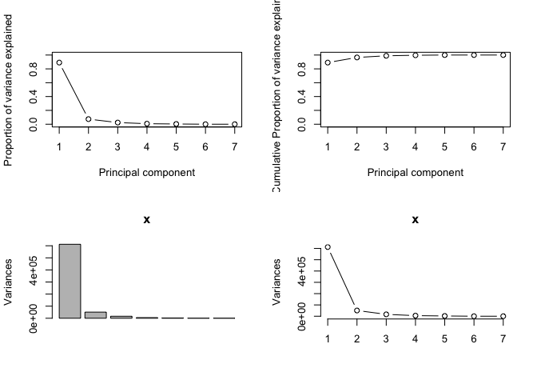

---
title: <center><h1>2018R1 High-Dimensional Data Analysis (STAT5103) Assignment 4</h1></center><br />
author: <center>Yiu Chung WONG 1155017920</center>
output:
  html_document:
    keep_md: yes
  pdf_document: default
  word_document: default
--- 
<br />
<br />


#Principal Component Analysis (PCA) on uscrime Dataset


```r
uscrime <- read.csv('uscrime.txt', header = FALSE, sep = '')
names <- c("Land_area", "Population", "Murder", "Rape", "Robbery", "Assault", "Burglary", "Larceny", "Auto_theft", "states_region_num", "states_division_num")
names(uscrime) <- names
uscrime <- uscrime[,3:9]
summary(uscrime)
```

```
##      Murder            Rape          Robbery          Assault         Burglary         Larceny    
##  Min.   : 0.500   Min.   : 3.60   Min.   :  6.50   Min.   : 21.0   Min.   : 286.0   Min.   : 694  
##  1st Qu.: 3.500   1st Qu.:10.35   1st Qu.: 46.77   1st Qu.: 84.5   1st Qu.: 681.5   1st Qu.:1424  
##  Median : 6.200   Median :14.95   Median : 76.70   Median :125.0   Median : 871.0   Median :1923  
##  Mean   : 6.858   Mean   :15.62   Mean   :101.51   Mean   :135.4   Mean   : 930.8   Mean   :1944  
##  3rd Qu.: 9.575   3rd Qu.:19.35   3rd Qu.:126.88   3rd Qu.:191.5   3rd Qu.:1140.0   3rd Qu.:2316  
##  Max.   :15.300   Max.   :36.00   Max.   :443.30   Max.   :293.0   Max.   :1753.0   Max.   :3550  
##    Auto_theft   
##  Min.   : 78.0  
##  1st Qu.:219.0  
##  Median :343.0  
##  Mean   :367.9  
##  3rd Qu.:513.8  
##  Max.   :878.0
```
<br />

#Analyzing uscrime.txt dataset
carm.txt data sets comes with basic data set with 7 variables. Using PCA, we are going to find linear combinations of the variables that both maximizes variance and are mutually uncorrelated.

```r
head(uscrime)
```

```
##   Murder Rape Robbery Assault Burglary Larceny Auto_theft
## 1    1.5  7.0    12.6      62      562    1055        146
## 2    2.0  6.0    12.1      36      566     929        172
## 3    1.3 10.3     7.6      55      731     969        124
## 4    3.5 12.0    99.5      88     1134    1531        878
## 5    3.2  3.6    78.3     120     1019    2186        859
## 6    3.5  9.1    70.4      87     1084    1751        484
```


###A. Compute the Principal Components. <br />


```r
#Principle Component using non-centered, non-scaled datas
uscrime_pca <- prcomp(uscrime)
names(uscrime_pca)
```

```
## [1] "sdev"     "rotation" "center"   "scale"    "x"
```

```r
uscrime_pca
```

```
## Standard deviations (1, .., p=7):
## [1] 782.538686 225.269676 128.660845  71.792754  47.400887   4.311237   2.048636
## 
## Rotation (n x k) = (7 x 7):
##                     PC1          PC2          PC3         PC4         PC5          PC6
## Murder     0.0005577137 -0.005760864  0.008027502  0.02524800  0.04385251  0.071466187
## Rape       0.0060079658 -0.007734222  0.009235682  0.03243755  0.03984021  0.995832256
## Robbery    0.0588388427 -0.203010402 -0.075368577  0.80352534 -0.55131855 -0.005076412
## Assault    0.0326841159 -0.121106537  0.118059296  0.54065493  0.82012859 -0.056187201
## Burglary   0.4029068556 -0.717807729  0.525825003 -0.20479525 -0.06301687 -0.003718890
## Larceny    0.8985571347  0.428017635 -0.086345714  0.04231122  0.01179745 -0.003049824
## Auto_theft 0.1602949591 -0.495560234 -0.834436532 -0.12891192  0.12576315  0.002190604
##                      PC7
## Murder      0.9961095026
## Rape       -0.0741449176
## Robbery     0.0036690522
## Assault    -0.0474478861
## Burglary   -0.0003825568
## Larceny     0.0012951311
## Auto_theft  0.0013425943
```

Above PCA output returns 7 variable loadings as rotation. The number of variable loadings in rotation is equal to the number of variables in the data set. These are also the eigen vectors of the covariance matrix of the original dataset.

Next step is to identify coverage of variance in dataset by individual Principal Components. `summary()` function can be used or scree plot can be used to explain the variance.

```r
summary(uscrime_pca)
```

```
## Importance of components:
##                             PC1       PC2       PC3     PC4      PC5     PC6     PC7
## Standard deviation     782.5387 225.26968 128.66084 71.7928 47.40089 4.31124 2.04864
## Proportion of Variance   0.8912   0.07386   0.02409  0.0075  0.00327 0.00003 0.00001
## Cumulative Proportion    0.8912   0.96510   0.98920  0.9967  0.99997 0.99999 1.00000
```


```r
pcaCharts(uscrime_pca)
```

```
## [1] "proportions of variance:"
## [1] 8.912460e-01 7.385696e-02 2.409233e-02 7.501484e-03 3.270084e-03 2.705140e-05 6.108230e-06
```



The first principle component explains almost 90% of the variance!

If we were to perform data reduction, we can conclude that the first principle component is enough to represent the entire dataset. In the context of factor analysis, the reason why all 7 variables 
have similar patterns of responses is because they are all governed by one latent variable.

Since the dataset is called `uscrime`, we can easily conclude that the one underlining, measurable variable, is crime! However, this is boring. We didn't even need principle component analysis to know all variables in the dataset are governed by crime data in the U.S.. 

We can try to divide the variables into groups according to their common characteristics; maybe there are more than one latent variable governing these variables. Since the first two principle components can explain over 96% of the variance, we may start with two factors.
<br />

#Maximum Likelihood Factor Analysis without rotation

```r
mlm <- psych::fa(uscrime, nfactors = 2, rotate = "none", fm="ml")
mlm_load <- mlm$loadings[1:7,]
mlm_com <- mlm$communalities
mlm_psi <- mlm$uniquenesses 
mlm_tbl <- cbind(mlm_load, mlm_com, mlm_psi)
mlm_tbl
```

```
##                  ML1        ML2   mlm_com    mlm_psi
## Murder     0.7014174 -0.5109209 0.7530249 0.24697347
## Rape       0.8057140  0.1127550 0.6618874 0.33811128
## Robbery    0.6761068  0.1819860 0.4902419 0.50976068
## Assault    0.9116260 -0.3404695 0.9469814 0.05301856
## Burglary   0.7792362  0.5525550 0.9125262 0.08747401
## Larceny    0.5787920  0.6244166 0.7248968 0.27510376
## Auto_theft 0.5424111  0.4850448 0.5294785 0.47052177
```

```r
mlm$Vaccounted
```

```
##                             ML1       ML2
## SS loadings           3.6657627 1.3532738
## Proportion Var        0.5236804 0.1933248
## Cumulative Var        0.5236804 0.7170052
## Proportion Explained  0.7303718 0.2696282
## Cumulative Proportion 0.7303718 1.0000000
```
<br />

Factor loadings can be interpreted like standardized regression coefficients, one could also say that the variable Assault` has a correlation of 0.911626 with Factor 1.

The precise value of each loading are not our main concern; we ar?re looking for groups of high values that hopefully make sense and lead to a descriptive factor. Without rotation, all 7 variables load on the first two axes and is currently impossible to see any patterns.

`Robbery` and `Auto_theft` have relatively high $\Psi$ value, this is bad because a high $\Psi$ indicates that particular variable is unique and does not load into any factor well. 

If we subtract the $\Psi$ value from 1, we get the column commonality. Commonality is the proportion of variance of the $i$th variable contributed by the m common factors. Looking at the commonality for the variable Assault, which has a value of 4. This value can be interpreted as: 400% of the Assault variance was contributed by the two common factors. Since some of the $\Psi$ values are high, the two factors may not be explaining the overall variance so well. 

Sum of squared loadings tells us how much of all observed variance was explained by that factor. Here, the first factor is able to explain 3.6657627 units of variance. Some say a factor is worth keeping if the SS loading is greater than 1. This is the case for both factors factor.

The two factors explains roughly 71.7% of the total variance. 

Since our factor loadings are difficult to interpret, perhaps we can get better results if we perform rotation on the loading.

#Maximum Likelihood Factor Analysis with varimax rotation

```r
mlmv <- psych::fa(uscrime, nfactors = 2, rotate = "varimax", fm="ml")
mlmv_load <- mlmv$loadings[1:7,]
mlmv_com <- mlmv$communalities
mlmv_psi <- mlmv$uniquenesses 
mlmv_tbl <- cbind(mlmv_load, mlmv_com, mlmv_psi)
mlmv_tbl
```

```
##                   ML2        ML1  mlmv_com   mlmv_psi
## Murder     0.03750537 0.86696013 0.7530249 0.24697347
## Rape       0.59027275 0.55988106 0.6618874 0.33811128
## Robbery    0.56365221 0.41537394 0.4902419 0.50976068
## Assault    0.30180786 0.92514510 0.9469814 0.05301856
## Burglary   0.91773845 0.26510777 0.9125262 0.08747401
## Larceny    0.84903260 0.06356003 0.7248968 0.27510376
## Auto_theft 0.71735947 0.12195745 0.5294785 0.47052177
```

```r
mlmv$Vaccounted
```

```
##                             ML2       ML1
## SS loadings           2.8363252 2.1827113
## Proportion Var        0.4051893 0.3118159
## Cumulative Var        0.4051893 0.7170052
## Proportion Explained  0.5651135 0.4348865
## Cumulative Proportion 0.5651135 1.0000000
```
<br />

After Varimax rotation, the factors are also a little more clear to interpret. `Murder`and `Assault`, are heavily loaded onto ML1. So it's clear that this is the Violence factor. The rest load heavily onto ML2, which maybe summarised as the 'Theft' factor. The variable `Rape` exhibits cross load; it is loaded onto both factors roughly 50/50. Perhaps Theft and Rape often occur at the same time, which does not sound surprising.

Both SS loadings remain greater than 1. Also, the SS loadings are more evenly divided between both factors than before rotation. The difference between the variance explained among the two factors also narrowed, but the sum remains the same. Therefore rotation is able to better separate the latent factors using our variables, but does not improve the relationship between variables and factors. This is also evident by looking at the $\Psi$ values, which are exactly the same as before rotation. 

#Principal Component Factor Analysis with varimax rotation

```r
pcfa <- psych::principal(r = uscrime, nfactors = 2, rotate = "varimax")
pcfa_load <- pcfa$loadings[1:7,]
pcfa_com <- pcfa$communality
pcfa_psi <- pcfa$uniquenesses 
pcfa_tbl <- cbind(pcfa_load, pcfa_com, pcfa_psi)
pcfa_tbl
```

```
##                    RC1        RC2  pcfa_com   pcfa_psi
## Murder     -0.01422957 0.95142861 0.9054189 0.09458113
## Rape        0.59872703 0.62026282 0.7432000 0.25679998
## Robbery     0.65994912 0.42369170 0.6150475 0.38495250
## Assault     0.30167922 0.90609726 0.9120226 0.08797741
## Burglary    0.89018215 0.28017683 0.8709233 0.12907669
## Larceny     0.87001432 0.05058181 0.7594834 0.24051657
## Auto_theft  0.83458528 0.07610979 0.7023253 0.29767471
```

```r
pcfa$Vaccounted
```

```
##                             RC1       RC2
## SS loadings           3.1311015 2.3773195
## Proportion Var        0.4473002 0.3396171
## Cumulative Var        0.4473002 0.7869173
## Proportion Explained  0.5684209 0.4315791
## Cumulative Proportion 0.5684209 1.0000000
```

Principal Component Factor Analysis gives even clearer separation than Maximum Likelihood Factor Analysis. Variables in our 'Theft' factor 'Violence factor have more even loadings than before. 

The distance difference between the two methods can be seen in the $\Psi$ values. Principal Component Factor Analysis gives lower $\Psi$ values which sums up to 1.491579; whereas $\Psi$ values from Maximum Likelihood Factor Analysis sums up to 1.9809635.  By using Principal Component Factor Analysis, latent factors explains more variation of each of our variables. Both SS loadings and Proportion Variance are higher using Principal Component Factor Analysis. 

The fact that Principal Component Factor Analysis finds latent factors which explains more variation is because PCA is inherently a method for finding directions/rotations of maximum variance from data sets. 
