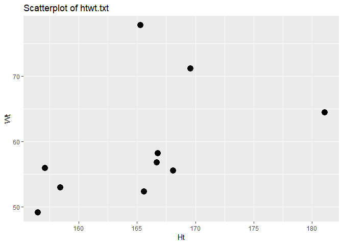

---
title: <center><h1> 2018R1 Regression in Practice (STAT5102)  Assignment 1</h1></center><br />
author: <center>Yiu Chung WONG 1155017920</center>
output:
  html_document:
    keep_md: yes
  pdf_document: default
  word_document: default
--- 
<br />
<br />


```r
htwt <- read.csv("htwt.txt", header = TRUE, sep = " ")
oldfaith <- read.csv("oldfaith.txt", header = TRUE, sep = " ")[-3]
```
<br />

####3a. 
<!-- -->
<br />
Based on the information given by this scatterplot, it is possible to model the data using simple linear regression for the following reasons:

1. There seems to be a trend between weight and height.
2. The tread seems to be linear.
3. Both weight and height exhibit reasonable variation, hence we can more confidently pin down the relationship between the predictor and the target.
4. The sample size of 10 is enough (barely) to perform a simple linear regression.
<br />

####3b. 

```r
Sxx = sum((htwt$Ht - mean(htwt$Ht))^2)
Syy = sum((htwt$Wt - mean(htwt$Wt))^2)
Sxy = sum((htwt$Ht - mean(htwt$Ht)) * (htwt$Wt - mean(htwt$Wt)))
x <- c(mean(htwt$Ht), mean(htwt$Wt), Sxx, Syy, Sxy)
names(x) <- c("Ht_mean", "Wt_mean", "Sxx", "Syy", "Sxy")
x
```

```
## Ht_mean Wt_mean     Sxx     Syy     Sxy 
## 165.520  59.470 472.076 731.961 274.786
```

```r
model <- lm(data = htwt, Wt ~ Ht)
model$coefficients
```

```
## (Intercept)          Ht 
##   -36.87588     0.58208
```

```r
ggplot(data = htwt, aes(x = Ht, y = Wt)) + geom_point(size = 4) + geom_smooth(method = lm, se = FALSE) + ggtitle("Scatterplot of htwt.txt")
```

<!-- -->
<br />

####3c. 

```r
MSE = sum(model$residuals^2)/(nrow(htwt)-2) %>% round(., 4)
b1_SE = summary(model)$coefficients[2, 2] %>% round(., 4)
b0_SE = summary(model)$coefficients[1, 2] %>% round(., 4)

x <- matrix(c(MSE, b0_SE, MSE, b1_SE), 2, 2, byrow = F, dimnames = list(c("MSE", "standard error"), c("intercept", "b1")))
x
```

```
##                intercept      b1
## MSE              71.5017 71.5017
## standard error   64.4728  0.3892
```

```r
#cov(b0, b1)
unname(-mean(htwt$Ht) * diag(vcov(model))[2])
```

```
## [1] -25.07003
```

```r
summary(model)$coefficients
```

```
##              Estimate Std. Error    t value  Pr(>|t|)
## (Intercept) -36.87588 64.4728000 -0.5719603 0.5830589
## Ht            0.58208  0.3891815  1.4956517 0.1731089
```
<br />

####3d. 

```r
anova(lm(data = htwt, Wt ~ Ht))
```

```
## Analysis of Variance Table
## 
## Response: Wt
##           Df Sum Sq Mean Sq F value Pr(>F)
## Ht         1 159.95 159.947   2.237 0.1731
## Residuals  8 572.01  71.502
```
* Since the F value is low and p-value greater than .05, there is a high probability that $\beta_{1}$ is zero and $b_{1}$ isn't zero is simply due to chance. 
* The p-value of ANOVA and p-value of $b_{1}$ in t-test equats.

####4a.  <br />


```r
oldfaith_model <- lm(data = oldfaith, Interval ~ Duration)
summary(oldfaith_model)$coefficients
```

```
##               Estimate Std. Error  t value     Pr(>|t|)
## (Intercept) 33.9878076 1.18121714 28.77355 6.133342e-84
## Duration     0.1768629 0.00535212 33.04540 1.624248e-96
```

$$
\begin{align*}
\mathrm{\hat{Interval}} = 33.9878076 
    &+ 0.1768629\;  \mathrm{Duration}    \\
\end{align*}
$$

* The $b_{1}$ is 0.1768629. This means for every second increase in the current eruption, the wait time will increase by 0.1768629 minute. 
<br />

####4b.  <br />

```r
predict(oldfaith_model, newdata=list(Duration=250), interval="confidence", level=.95)
```

```
##        fit      lwr      upr
## 1 78.20354 77.36915 79.03794
```
<br />

####4c.  <br />

```r
predict(oldfaith_model, newdata=list(Duration=250), interval="prediction", level=.95)
```

```
##        fit      lwr      upr
## 1 78.20354 66.35401 90.05307
```


####5.  <br />
* When there is no variation in the predictor variable, the denominator of the closed-form formula of $b_{1}$ is zero. Thereby $b_{1}$ is not defined. Regression tries to answer the question: How does y change, on average, when X changes by one unit? This question cannot be answered if X doesn't change.
