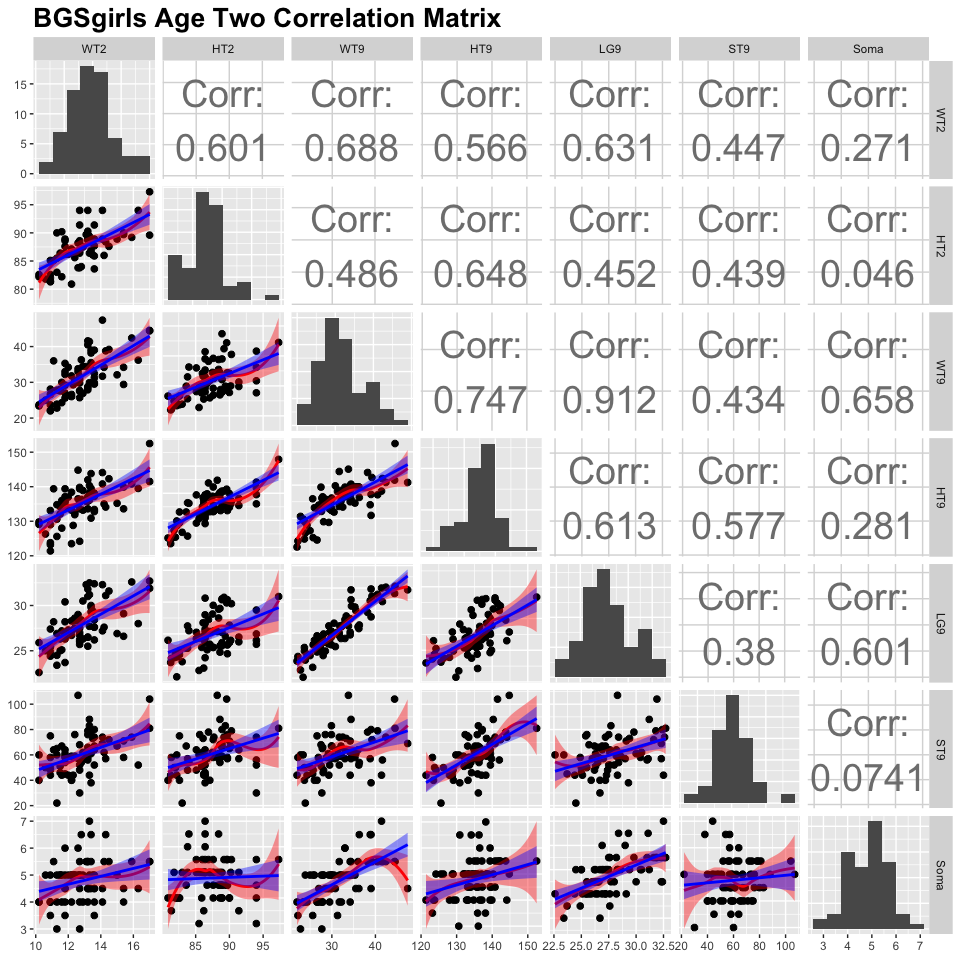

---
title: <center><h1> 2018R1 Regression in Practice (STAT5102)  Assignment 2</h1></center><br />
author: <center>Yiu Chung WONG 1155017920</center>
output:
  html_document:
    keep_md: yes
    code_folding:
  pdf_document: default
  word_document: default
--- 
<br />


```r
BGSall <- read.csv("BGSall.txt", header = TRUE, sep = " ")
BGSboys <- read.csv("BGSboys.txt", header = TRUE, sep = " ")
BGSgirls <- read.csv("BGSgirls.txt", header = TRUE, sep = " ")
maple <- read.table("maple.txt", header = TRUE, sep = "", stringsAsFactors = TRUE)
```

###1. 
####[Berkeley Guidance Study] The Berkeley Guidance Study enrolled children born in Berkeley, California, between January 1928 and June 1929, and then measured them periodically until age eighteen (Tuddenham and Snyder, 1954). The data we use is described in Table 1, and the data is given in the data files BGSgirls.txt for girls only, and BGSall.txt for boys and girls combined.

####a. For the girls only, draw the scatterplot matrix of all the age two variables, all the age nine variables and Soma. Write a summary of the information in this scatterplot matrix. Also obtain the matrix of sample correlations between the height variables

```r
my.lm <- function(data, mapping, ...){
  p <- ggplot(data = data, mapping = mapping) + 
    geom_point(size = 2) + 
    geom_smooth(method = loess, fill = "red", color = "red", size = 1, ...) +
    geom_smooth(method = lm, fill = "blue", color = "blue", size = 1, ...)
  p
}


g <- ggpairs(
        BGSgirls, 
        columns = c(2:7, 12),
        upper = list(continuous = wrap("cor", size = 10, method = "spearman")),
        diag = list(continuous = wrap("barDiag", bins = sqrt(nrow(BGSgirls)))),
        lower = list(continuous = my.lm)
        )

g <- g + ggtitle("BGSgirls Age Two Correlation Matrix") + 
        theme(plot.title = element_text(lineheight = .8,
                                        face = "bold",
                                        size = 20), 
              axis.title.x = element_text(size = 10))

g
```


<br />

* `Soma` is the dependent variable to be used for the regression analysis. It appears to have moderate linear relations with 
several other variables such as `ST9` and `WT9`.

* Each predictors look fairly normal. Although OLS regression does not assume normality in the predictors, non-normal data **MAY** cause the relationship between them and the target variable to be non-linear. Looking at the bottom row and comparing loess curves (red) to the linear regression lines (blue) of all the graphs, the relationships between these predictors and `Soma` are relatively linear, so no linear transformations is required prior to modelling.
<br />

* In the same row, points are scattered around fairly evenly. This means variance are consistent across value of `Soma` and the predictors. Hence heteroskedasticity not likely to exist in the residual terms.

* Many predictors are highly correlated to each other. For example, `HT9` and `WT9` have correlation 0.728; `LG9` and `WT9` have correlation 0.904. Collinearity can also hide amongst the whole set of predictors instead of just two. Therefore, we are not safe from  multicollinearity simply because other predictors are of lower correlation. Other metrics such as Variance Inflation Factor is better at simultaneously evaluating one predictor against all others. One must be caution of multicollinearity in this dataset because they reduces the precision of the estimate coefficients (by weakening statistical power), as well as making coefficients sensitive (varies greatly) under the presence of other predictors in the model. 


```r
cor(BGSgirls[,c(3, 5, 9)])
```

```
##            HT2       HT9      HT18
## HT2  1.0000000 0.7383562 0.6633351
## HT9  0.7383562 1.0000000 0.8078083
## HT18 0.6633351 0.8078083 1.0000000
```
<br />

####b. Fit the multiple linear regression model with mean function

$$
\begin{align*}
 \operatorname{E} (Soma \mid X ) = \beta_0 + \beta_1 HT2 + \beta_2 WT2 + \beta_3 HT9 + \beta_4 WT9 + \beta_5 ST9   \\
\end{align*}
$$

####based on BGSall.txt. Find *$\sigma^2$*, *$R^2$*, the overall analysis of variance table and overall F-test.  Compute the t-statistics to be used to test each of the *$\beta_{j}$* to be zero against two-sided alternatives. Explicitly state the hypotheses tested and the conclusions.


```r
BGSall_model = lm(data = BGSall, Soma ~ HT2 + WT2 + HT9 + WT9 + ST9)
```

* *$\sigma^2$* = 1.2681744 
* *$R^2$* = 0.4070276
<br />

```r
null_model = lm(data = BGSall, Soma ~ 1)
anova(null_model, BGSall_model)
```

```
## Analysis of Variance Table
## 
## Model 1: Soma ~ 1
## Model 2: Soma ~ HT2 + WT2 + HT9 + WT9 + ST9
##   Res.Df    RSS Df Sum of Sq      F    Pr(>F)    
## 1    135 278.03                                  
## 2    130 164.86  5    113.17 17.847 1.924e-13 ***
## ---
## Signif. codes:  0 '***' 0.001 '**' 0.01 '*' 0.05 '.' 0.1 ' ' 1
```


* $H_{0}$: (HT2 == WT2 == HT9 == WT9 == ST9 == 0)
* $H_{1}$: At least a \beta_{j} =/= 0
* $F$ = 17.846899
* $p$ = 1.9235661\times 10^{-13}
* The p-value of the F-test is smaller then .05 critical value, we reject $H_{0}$: at least one $\beta_{j}$ =/= 0
<br />

```r
#t-statistics
summary(BGSall_model)$coefficients
```

```
##                Estimate  Std. Error    t value     Pr(>|t|)
## (Intercept) 11.44677326 3.247612772  3.5246731 5.860385e-04
## HT2         -0.05459552 0.046445025 -1.1754869 2.419483e-01
## WT2         -0.36201776 0.089947976 -4.0247461 9.629192e-05
## HT9         -0.01465272 0.031584213 -0.4639255 6.434770e-01
## WT9          0.19412166 0.024787485  7.8314381 1.495117e-12
## ST9         -0.03200090 0.007853561 -4.0746993 7.967579e-05
```

####HT2
* $H_{0}$: $\beta_{1}$ == 0
* $H_{1}$: $\beta_{1}$ =/= 0
* $T$ = -1.1754869
* $p$ = 0.2419483
* The p-value of the T-test is greater then .05 critical value, we cannot reject $H_{0}$. $\beta_{1}$ == 0
<br />

####WT2
* $H_{0}$: $\beta_{2}$ == 0
* $H_{1}$: $\beta_{2}$ =/= 0
* $T$ = -4.0247461
* $p$ = 9.6291923\times 10^{-5}
* The p-value of the T-test is smaller then .05 critical value, we reject $H_{0}$. $\beta_{2}$ =/= 0
<br />

####HT9
* $H_{0}$: $\beta_{3}$ == 0
* $H_{1}$: $\beta_{3}$ =/= 0
* $T$ = -0.4639255
* $p$ = 0.643477
* The p-value of the T-test is greater then .05 critical value, we cannot reject $H_{0}$. $\beta_{3}$ == 0
<br />

####WT9
* $H_{0}$: $\beta_{4}$ == 0
* $H_{1}$: $\beta_{4}$ =/= 0
* $T$ = 7.8314381
* $p$ = 1.495117\times 10^{-12}
* The p-value of the T-test is smaller then .05 critical value, we reject $H_{0}$. $\beta_{4}$ =/= 0
<br />

####ST9
* $H_{0}$: $\beta_{5}$ == 0
* $H_{1}$: $\beta_{5}$ =/= 0
* $T$ = -4.0746993
* $p$ = 7.9675793\times 10^{-5}
* The p-value of the T-test is smaller then .05 critical value, we reject $H_{0}$. $\beta_{5}$ =/= 0
<br />

###2. 
####[A Genetic Study] Seeds sampled from trees in the eastern US and Canada were planted in a genetic study. The time of leafing out of these seedlings can be related to the latitude and mean July temperature of the place of origin of the seed. The variables are $X_{1}$ = latitude, $X_{2}$ = July mean temperature,and $Y$ = weightedmean index of leafing out time. ($Y$ is a measure of the degree to which the leafing out process has occurred. A high value is indicative that the leafing out process is well advanced.) The data is below and in the file maple.txt on Blackboard.

####a. Find the regression of `LeafIndex` on `Latitude`. Is `Latitude` a useful predictor of `LeafIndex`?

```r
a = lm(data = maple, LeafIndex ~ Latitude)
```
* $H_{0}$: $\beta_{1}$ == 0
* $H_{1}$: $\beta_{1}$ =/= 0
* $T$ = 6.1082054
* $p$ = 1.0307655\times 10^{-6}
* The p-value of the T-test is smaller then .05 critical value, we reject $H_{0}$. $\beta_{1}$ =/= 0
* Since this is a simple linear regression, the F-test should yield the same result. Hence we can say that the model is able to explain significantly more variation of `LeafIndex` than its mean.
<br />

####b. Repeat part (a) for the regression of `LeafIndex` on `JulyTemp`.

```r
b = lm(data = maple, LeafIndex ~ JulyTemp)
```

* $H_{0}$: $\beta_{1}$ == 0
* $H_{1}$: $\beta_{1}$ =/= 0
* $T$ = -5.3683407
* $p$ = 8.2326289\times 10^{-6}
* The p-value of the T-test is smaller then .05 critical value, we reject $H_{0}$. $\beta_{1}$ =/= 0
* Since this is a simple linear regression, the F-test should yield the same result. Hence we can say that the model is able to explain significantly more variation of `LeafIndex` than its mean.

<br />

####c. Find the regression of `LeafIndex` on `Latitude` and `JulyTemp`. Compare the results of this analysis with your results from (a) and (b). How different are the slope coefficients in each case. What best explains the differences in their values?


```r
c = lm(data = maple, LeafIndex ~ Latitude + JulyTemp)
summary(c)$coefficients
```

```
##               Estimate  Std. Error   t value   Pr(>|t|)
## (Intercept) 13.7318390 11.42026248  1.202410 0.23893086
## Latitude     0.3139276  0.12388008  2.534125 0.01693175
## JulyTemp    -0.1352401  0.09676374 -1.397632 0.17282454
```

* For the Intercept, `Latitude` , and `JulyTemp`, the point estimates and standard error are all different across the three models. 
* In the simple linear case, both models yield significant regression coefficients.
* In multiple regression, only `Latitude` has coefficients smaller than the .05 critical value; the coefficient of `JulyTemp` have p-value greater than the .05 critical value, meaning it is not significantly different from zero.
* The difference in significance of the regression coefficients can be best explained by collinearity. If we take a look at the correlation between `Latitude` and `JulyTemp`,


```r
with(maple, cor(Latitude, JulyTemp))
```

```
## [1] -0.8072089
```

we can see that the correlation is -0.8072089. This tells us that the two predictors are highly dependent on each other; they are close to linearly dependent. When two predictors are near linearly dependent, their standard error inflates. This reduces the precision of the estimate coefficients (by weakening statistical power), as well as making coefficients sensitive (varies greatly) under the presence of other predictors in the model.


* In our case, we do not have enough statistical power to prove `JulyTemp` is significantly different from zero.
<br />

####d. Find ANOVA tables for the model in part (a) (`LeafIndex` = $\beta_{0}$ + $\beta_{1}$`Latitude` + $\epsilon$) and the model in part (c) (`LeafIndex` = $\beta_{0}$ + $\beta_{1}$`Latitude` + $\beta_{2}$`JulyTemp` + $\epsilon$). What parts of the row of the ANOVA table corresponding to Latitude are the same and what parts are different? To what formal hypothesis test does the p-value in the Latitude row of each ANOVA table correspond? Why are the p-values different?


```r
anova(a)
```

```
## Analysis of Variance Table
## 
## Response: LeafIndex
##           Df  Sum Sq Mean Sq F value    Pr(>F)    
## Latitude   1 104.406 104.406   37.31 1.031e-06 ***
## Residuals 30  83.949   2.798                      
## ---
## Signif. codes:  0 '***' 0.001 '**' 0.01 '*' 0.05 '.' 0.1 ' ' 1
```

```r
anova(c)
```

```
## Analysis of Variance Table
## 
## Response: LeafIndex
##           Df  Sum Sq Mean Sq F value    Pr(>F)    
## Latitude   1 104.406 104.406 38.4959 9.103e-07 ***
## JulyTemp   1   5.298   5.298  1.9534    0.1728    
## Residuals 29  78.652   2.712                      
## ---
## Signif. codes:  0 '***' 0.001 '**' 0.01 '*' 0.05 '.' 0.1 ' ' 1
```

* Degrees of freedom, sum of squared error, and mean squared error are the same between the two tables.
* The F-values and the p-values are different between the two tables.
* $H_{0}$: $\beta_{1}$ == 0
* $H_{1}$: $\beta_{1}$ =/= 0
* The F-value is the ratio between variation explained by that particular predictor v.s. variation not explained by any predictors. In the full model (with `JulyTemp`), a small portion of the variation is explained away by `JulyTemp`. Hence there are less unexplained variation in the full model than in the partial model (without `JulyTemp`). Because of this, the ratio between the variation explained by `Latitude` and unexplained variation is greater in the full model: MSE of `Latitude` in the full model is divided by a smaller number compared to that in the partial model. 
* A different F-value coupled with a slightly different degrees of freedom in the residuals yield a different p-value.
