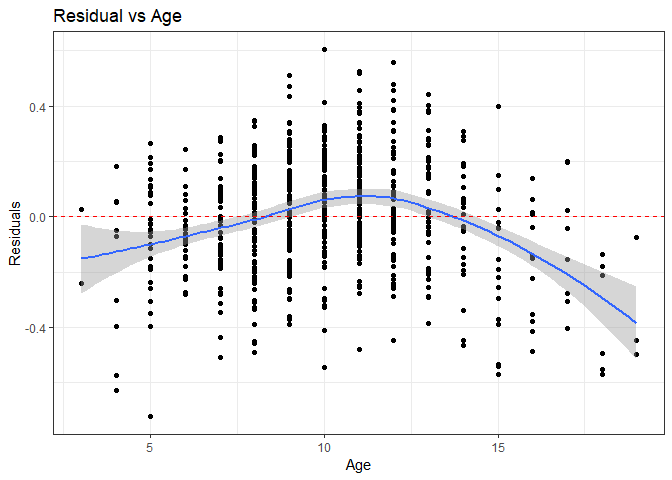
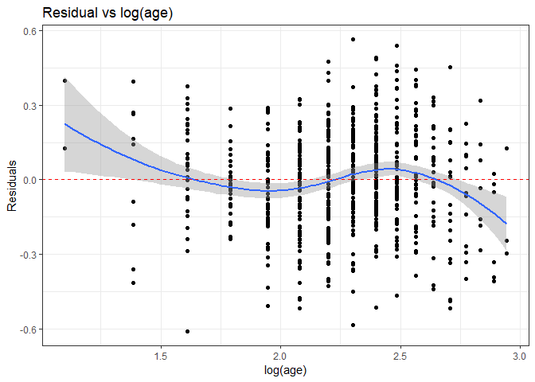
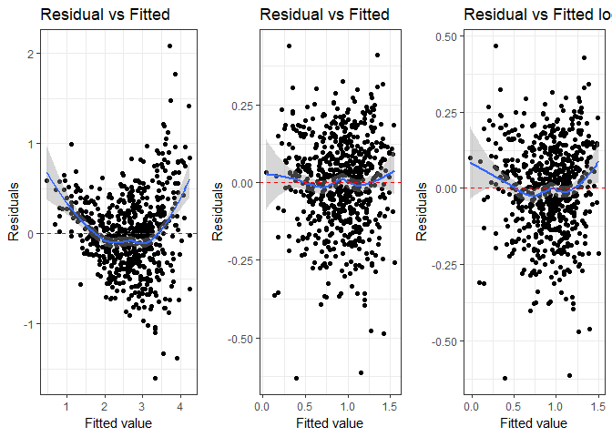
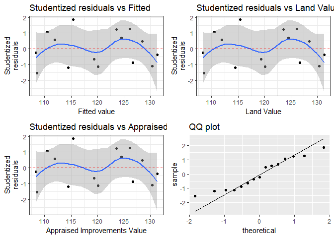

---
title: <center><h1> 2018R1 Regression in Practice (STAT5102)  Assignment 3</h1></center><br />
author: <center>Yiu Chung WONG 1155017920</center>
output:
  html_document:
    keep_md: yes
    code_folding:
  pdf_document: default
  word_document: default
--- 
<br />


```r
fevdata <- read.csv("fevdata.txt", header = TRUE, sep = "")
HAMILTON <- read.csv("HAMILTON.txt", header = TRUE, sep = "\t")
basketball = read.csv("Basketball.txt")
names(basketball)[names(basketball) == 'X.1'] <- 'Win'


levels(fevdata$sex) <- c(0,1)
levels(fevdata$smoke) <- c(0,1)
```

#1.

####Considerthedatainfevdata.txt:The first line contains the variable names which are age,fev,ht, sex, and smoke. In this assignment, we will consider models that use age (age of children, measured in years), ht (height of children in inches), and fev (forced expiratory volume, a measure of lung capacity, measured in litres).

####a. Fit a linear model to predict FEV from age. You may use the R function boxcox to find a simple power transformation (-1 = reciprocal, 0 = log, 0.5 = square root) close to the Box-Cox maximum likelihood estimate. Which simple transformation seems best?

```r
model_a <- lm(fevdata$fev ~ fevdata$age)
bc <- MASS::boxcox(model_a, plotit = FALSE)
best_lm <- bc$x[which(bc$y == max(bc$y))]
best_lm
```

```
## [1] 0.2
```
log transformation seems best.
<br />

####b. Fit a linear model with the best simple transformed response predicted by age and examine the residual plot of the fit. Has the transformation improved adherence to the constant variance assumption? Is this linear model acceptable? Briefly explain why or why not.

```r
model_b <- lm(I(log(fevdata$fev)) ~ fevdata$age)
p1<-ggplot(model_b, aes(fevdata$age, resid(model_b))) + geom_point()
    p1<-p1+stat_smooth(method="loess")+geom_hline(yintercept=0, col="red", linetype="dashed")
    p1<-p1+xlab("Age")+ylab("Residuals")
    p1<-p1+ggtitle("Residual vs Age")+theme_bw()
p1
```


The transformation has not improved adherence to the constant variance assumption. This linear model is not acceptable because the variance is not constant along the x axis.
<br />

####c. Repeat parts(a) and (b) using log(age) as the explanatory variable. Which set of transformations of fev and age seems to be best to match linear model assumptions?

```r
model_log_a <- lm(fevdata$fev ~ I(log(fevdata$age)))
bc <- MASS::boxcox(model_log_a, plotit = FALSE)
best_lm <- bc$x[which(bc$y == max(bc$y))]
best_lm
```

```
## [1] 0
```

```r
log_a <- lm(I(log(fevdata$fev)) ~ I(log(fevdata$age)))
p2<-ggplot(log_a, aes(log(fevdata$age), resid(log_a))) + geom_point()
    p2<-p2+stat_smooth(method="loess")+geom_hline(yintercept=0, col="red", linetype="dashed")
    p2<-p2+xlab("log(age)")+ylab("Residuals")
    p2<-p2+ggtitle("Residual vs log(age)")+theme_bw()
p2
```



The shape of the loss function is different but seem equally bad. In particular, it exhibit similar sine wave like shape alone the x axis. This time, the curvatures are worst at low and high x values.

<br />

####d. Add a second explanatory variable, ht, or a transformation of it, to the model found in (c). Write an equation to express the model. Find 95% confidence intervals for each model parameter (one intercept and two slopes) in the (possibly) transformed scale. As best as you can, interpret these confidence intervals in the scale of the initial measurements.  (Note: There is no single set of transformations that is unambiguously best. Use your judgment.)

```r
model_d_1 <- lm(fevdata$fev ~ I(log(fevdata$age)) + fevdata$ht)
p3<-ggplot(model_d_1, aes(.fitted, .resid)) + geom_point()
p3<-p3+stat_smooth(method="loess")+geom_hline(yintercept=0, col="red", linetype="dashed")
p3<-p3+xlab("Fitted value")+ylab("Residuals")
p3<-p3+ggtitle("Residual vs Fitted")+theme_bw()

model_d_2 <- lm(I(log(fevdata$fev)) ~ I(log(fevdata$age)) + fevdata$ht)
p4<-ggplot(model_d_2, aes(.fitted, .resid)) + geom_point()
p4<-p4+stat_smooth(method="loess")+geom_hline(yintercept=0, col="red", linetype="dashed")
p4<-p4+xlab("Fitted value")+ylab("Residuals")
p4<-p4+ggtitle("Residual vs Fitted")+theme_bw()

model_d_all_log <- lm(I(log(fevdata$fev)) ~ I(log(fevdata$age)) + I(log(fevdata$ht)))
p5<-ggplot(model_d_all_log, aes(.fitted, .resid)) + geom_point()
p5<-p5+stat_smooth(method="loess")+geom_hline(yintercept=0, col="red", linetype="dashed")
p5<-p5+xlab("Fitted value")+ylab("Residuals")
p5<-p5+ggtitle("Residual vs Fitted log(ht)")+theme_bw()

cowplot::plot_grid(p3, p4, p5, ncol = 3, nrow = 1)
```



According to the residual plots, the model with `ht` in it's original and log(`fev`) adheres best to the normality assumption. There are slightly less upward curvature from the dotted line for the model using `ht` at it's original scale. 
$$
\begin{align*}
 log(fev) = -2.1705476 + 0.1945704 \; log(Age) + 0.1945704 \; HT  \\
\end{align*}
$$


```r
CI <- confint(model_d_2)
CI
```

```
##                           2.5 %      97.5 %
## (Intercept)         -2.29651917 -2.04457606
## I(log(fevdata$age))  0.13069595  0.25844479
## fevdata$ht           0.03981037  0.04681717
```

We are 95% confident that the true intercept of the model is between -2.2965192 and -2.0445761. That is, on average, the logged value of `fev` will be somewhere between -2.2965192 and -2.0445761 when all other variables have values at zero.

We are 95% confident that the true elasticity of the variable `age` is between 0.130696 and 0.2584448. That is, on average, for every 1% increase in `age`, `fev` will increase by somewhere between 13.1% and 13.1%. 

We are 95% confident that the true coefficient of the variable `ht` is between 0.0398104 and 0.0468172. That is, for every unit increase in `ht`, `fev` will increase by somewhere between 3.98% and 4.68%, on average.
<br />


###2. 
####The multicollinearity problem can be illustrated with an example using the data shown in the dataset HAMILTON.txt. The values of x1,x2 and y in the table at right represent appraised land value, appraised improvements value and sale price, respectively, of a randomly selected residential property. (All measurements are in thousands of dollars.

####a. Calculate the coefficient of correlation between y and x1. Is there evidence of a linear relation between sale price and appraised land value? Repeat the same for (y,x2)

```r
cor(HAMILTON$Y, HAMILTON$X1)
```

```
## [1] 0.002497966
```

```r
cor(HAMILTON$Y, HAMILTON$X2)
```

```
## [1] 0.4340688
```

```r
y_cor_x1 <- cor.test(HAMILTON$Y, HAMILTON$X1)
y_cor_x1
```

```
## 
## 	Pearson's product-moment correlation
## 
## data:  HAMILTON$Y and HAMILTON$X1
## t = 0.0090066, df = 13, p-value = 0.993
## alternative hypothesis: true correlation is not equal to 0
## 95 percent confidence interval:
##  -0.510418  0.514103
## sample estimates:
##         cor 
## 0.002497966
```
The p-value of the Pearson correlation test is 0.9929506. There is no evidence of a linear relation between sale price and appraised land value.


```r
y_cor_x2 <- cor.test(HAMILTON$Y, HAMILTON$X2)
y_cor_x2
```

```
## 
## 	Pearson's product-moment correlation
## 
## data:  HAMILTON$Y and HAMILTON$X2
## t = 1.7373, df = 13, p-value = 0.106
## alternative hypothesis: true correlation is not equal to 0
## 95 percent confidence interval:
##  -0.1005527  0.7741858
## sample estimates:
##       cor 
## 0.4340688
```
The p-value of the Pearson correlation test is 0.1059593. There is no evidence of a linear relation between sale price and appraised land value.<br />

####b. Based on the results in (a), do you think the model
$$
\begin{align*}
 \operatorname{E} (y \mid X ) = \beta_0 + \beta_1 x_1 + \beta_2 x_2\\
\end{align*}
$$

####will be useful for predicting sale price?
 
No. Neither variables are significantly correlated to the response.

<br />

####c. Fit the model shown in (b) and conduct a test of model adequacy. In particular, note the value of R2. Does the result agree with your answer in (b)?

```r
HAMILTON_model <- lm(HAMILTON$Y ~ HAMILTON$X1 + HAMILTON$X2)
summary(HAMILTON_model)$coef
```

```
##               Estimate  Std. Error   t value     Pr(>|t|)
## (Intercept) -45.154136 0.611418065 -73.85149 2.527961e-17
## HAMILTON$X1   3.097008 0.012274433 252.31373 1.010771e-23
## HAMILTON$X2   1.031859 0.003684173 280.07891 2.888447e-24
```

```r
result <- data.frame(resid = MASS::studres(HAMILTON_model), fitted = HAMILTON_model$fitted.values)

HAMILTON_resid_fitted <- ggplot(result, aes(fitted, resid)) +
                        geom_point()+
                        stat_smooth(method="loess")+
                        geom_hline(yintercept=0, col="red", linetype="dashed")+
                        xlab("Fitted value")+
                        ylab("Studentized\nresiduals")+
                        ggtitle("Studentized residuals vs Fitted")+
                        theme_bw()

HAMILTON_resid_X1 <- ggplot(result, aes(fitted, resid)) +
                        geom_point()+
                        stat_smooth(method="loess")+
                        geom_hline(yintercept=0, col="red", linetype="dashed")+
                        xlab("Land Value")+
                        ylab("Studentized\nresiduals")+
                        ggtitle("Studentized residuals vs Land Value")+
                        theme_bw()

HAMILTON_resid_X2 <- ggplot(result, aes(fitted, resid)) +
                        geom_point()+
                        stat_smooth(method="loess")+
                        geom_hline(yintercept=0, col="red", linetype="dashed")+
                        xlab("Appraised Improvements Value")+
                        ylab("Studentized\nresiduals")+
                        ggtitle("Studentized residuals vs Appraised Improvements Value")+
                        theme_bw()

HAMILTON_qq <- ggplot(result, aes(sample = resid)) +
                stat_qq() +
                stat_qq_line() +
                ggtitle("QQ plot")

cowplot::plot_grid(HAMILTON_resid_fitted, HAMILTON_resid_X1, HAMILTON_resid_X2, HAMILTON_qq, ncol = 2, nrow = 2)
```

<!-- -->

The Studentized residual plots a sine pattern between the residuals and the fitted values/predictors; although the smooth curve tend to stay in range of zero, the bounce suggest possibility or correlation with the fitted values/predictors. The QQ plot tell us that the residuals are left tailed, suggesting nor-normality.

$R^2$ of the model is 0.999847, which is abnormally high. It is possible that there is a garbage predictor in the model boosting the $R^2$. 

The result does not match my prediction made in (b). In particular, I did not expect both coefficients to be significantly different fro zero, since neither predictor are significantly correlated with the response. 
<br />

####d. Calculate the coefficient of correlation between x1 and x2. What does the result imply? Compute also the VIFs for these two covariates.

```r
cor(HAMILTON$X2, HAMILTON$X1)
```

```
## [1] -0.8997765
```

The two are highly correlated. This implies colinearity.


```r
car::vif(HAMILTON_model)
```

```
## HAMILTON$X1 HAMILTON$X2 
##    5.252038    5.252038
```

VIF for both variables are over 5: one can explain a significant portion of variance of the other. One of the two is redundant in a multiple regression model. 
<br />

###3.  
####The text website has a data file(created from data at www.basketball-reference.com) showing, for each game in 2010-2011 season of the National Basketball Association in which Rajon Rondo of the Boston Celtics played, x = the number of assists he recorded and y = whether the Celtics won (1=yes). Using SAS, or other software,
<br />

####a. show that the logistic model fitted to these data gives

```r
basketball$Win <- sub("^W.*", 1, basketball$Win)
basketball$Win <- sub("^L.*", 0, basketball$Win)
basketball$Win = as.numeric(basketball$Win)
logit_model <- glm(Win ~ AST, data = basketball, family = "binomial")
coef(logit_model)
```

```
## (Intercept)         AST 
##  -2.2352669   0.2937756
```
<br />

####b. show that Pr(Y = 1 | x) increases from 0.21 to 0.99 over the observed range of x from 3 to 24

```r
predict(logit_model, newdata = data.frame(AST = c(3, 24)), type="response")
```

```
##         1         2 
## 0.2052270 0.9919608
```
<br />

####c. construct a significance test an confidence interval about the effect in the conceptual population that these games represent.

```r
exp(confint.default(logit_model))
```

```
##                  2.5 %    97.5 %
## (Intercept) 0.02094995 0.5461208
## AST         1.13952611 1.5792322
```

<br />

###4.  
####Derive the maximum likelihood estimate of p, denoted by pˆM LE from a random sample of Bernoulli random variables(X1,...,Xn),whereXi ∼Bern(p),i.i.d..

The probability of success of a single trial is
\begin{align}
P(x \mid p) = p^x(1-p)^{1-x}
\end{align}
and for a sequence of trials
\begin{align}
P(x_1,...,x_N \mid p) &= \prod_{i=1}^Np^{x_i}(1-p)^{1-x_i}.\\
&=p^{\sum_{i=1}^Nx_i}(1-p)^{N-\sum_{i=1}^Nx_i}.
\end{align}

We define the number of successes as
\begin{align}
k = \sum_{i=1}^Nx_i
\end{align}

Resulting in:
\begin{align}
P(x_1,...,x_N \mid p) &= p^{k}(1-p)^{N-k}.
\end{align}

Thus likelihood:
\begin{align}
L(p) = P(X \mid p) &= \binom{N}{k}p^{k}(1-p)^{N-k}.
\end{align}


<br />
