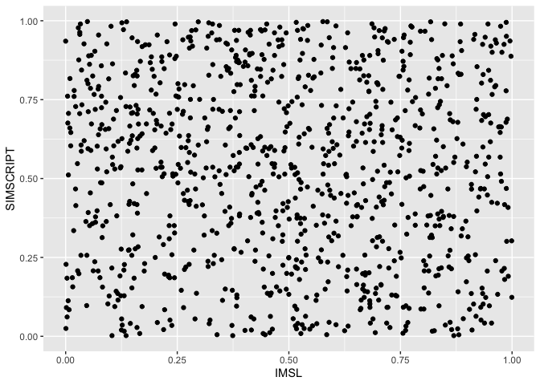
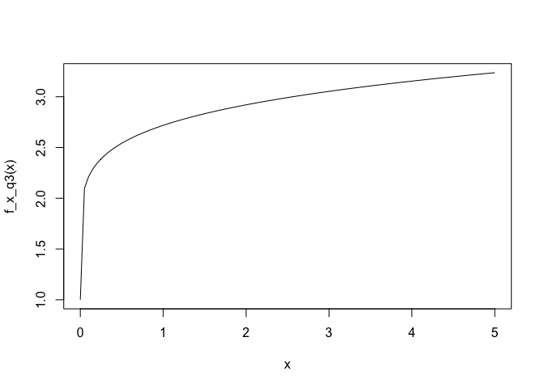

---
title: <center><h1> 2019R1 Applied Bayesian Methods (STAT6106) Assignment 3</h1></center><br />
author: <center>Yiu Chung WONG 1155017920</center>
output:
  html_document:
    keep_md: yes
  pdf_document: default
  word_document: default
--- 
<br />
<br />


```r
set.seed(6106);
```

#### 1.


```r
# Pseudo-Random-Number-Generator # out[1] = (a * seed)%%m
# out[i + 1] = (a * out[i])%%m

RNG = function(B = 100, seed = 0, a = 65539, m = 2^31) 
{ 
  out = rep(0, B);
  if (seed == 0) 
  {
    seed = as.numeric(format(Sys.time(), "%s")); #Using the computer's clock to set seed
  };
  
  out[1] = (a * seed)%%m; 
  
  for (i in 1:(B - 1)) 
  {
    out[i + 1] = (a * out[i])%%m;
  };
  
  return(out/m); #standardize it to the range of 0~1
}

randu3k=matrix(RNG(seed=12345,B=3000),ncol=3,byrow=TRUE);
plot3d(randu3k);
```


<br />

\newpage

#### 2.


```r
length <- 1000;
seed <- 1;
modulu <- 2^31 - 1;

IMSL <- RNG(B = length, seed = seed, a = 16807, m = modulu);
SIMSCRIPT <- RNG(B = length, seed = seed, a = 6303600167, m = modulu);

correlation <- cor(IMSL, SIMSCRIPT);
df <- data.frame(IMSL, SIMSCRIPT);
ggplot(data = df, aes(x = IMSL, y = SIMSCRIPT)) + geom_point();
```

<!-- -->
* The Pearson correlation between IMSL and SIMSCRIPT is -0.0534274.
\newpage

#### 3.

```r
f_x_q3 <- function(x)
{
  exp(x^0.10);
}

curve(f_x_q3, from = 0, to = 5);
```

<!-- -->
From the graph above, we know the function over the input range zero to five is monotonically increasing. Hence the maximum value can be optained using the largest input.


```r
n <- c(100, 1000, 10000);
integral <- c();

maxValue <- f_x_q3(5);
area <- 5 * maxValue;

for (sampleSize in n)
{
  x <- runif(sampleSize, 0, 5.0);
  fx <- runif(sampleSize, 0, maxValue);
  blueBalls <- ifelse(fx < f_x_q3(x), 1, 0);
  probability <- mean(blueBalls);
  integral <- c(integral, area * probability);
}
```
* The integrals approximations are: 15.0516281, 14.6308299, 14.5482887.
<br />

#### 4

```r
f_x_q4 <- function(x)
{
  abs(sin(x)) * exp(-x);
}
```


```r
set.seed(0);
means <- c();
variances <- c();
n <- sample(10:100000, 10)
for (sampleSize in n)
{
  fxs <- f_x_q4(0:sampleSize);
  means <- c(means, mean(fxs));
  variances <- c(variances, var(fxs)/sampleSize);
}
df <- data.frame(sample_Size = n, means, variances);
kable(df);
```


 sample_Size      means   variances
------------  ---------  ----------
       82946   5.60e-06           0
       13227   3.49e-05           0
       61920   7.50e-06           0
       41239   1.12e-05           0
       79044   5.80e-06           0
       45034   1.03e-05           0
       50462   9.10e-06           0
       90451   5.10e-06           0
       61266   7.50e-06           0
       42718   1.08e-05           0
<br />

