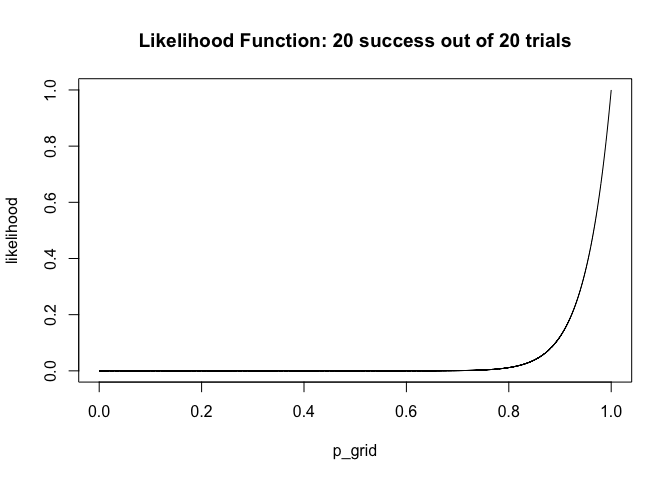

---
title: <center><h1> 2019R1 Discrete Data Analysis (STAT5107) Assignment 1</h1></center><br />
author: <center>Yiu Chung WONG 1155017920</center>
output:
  html_document:
    keep_md: yes
  pdf_document: default
  word_document: default
--- 
<br />
<br />


```r
set.seed(5107);
```

#### 1.

a. nominal
b. ordinal
c. interval
d. nominal
e. ordinal
f. nominal
g. ordinal
<br />

#### 2.

Variance of binomial distribution is

$$
\begin{align}
 \sigma^2  = n \pi (1-\pi)
\end{align}
$$

* When $\pi$ is close to zero, everything is multiplied by a value close to zero, hence $\sigma^2$ is small.
* When $\pi$ is close to one, everything is multiplied by (1 - somehting close to one), which is close to zero. Hence $\sigma^2$ is also small. 
* When $\pi$ is close to `0.5` , `n` is multiplied by `0.5 * (1 - 0.5)`, which is close to 0.25, which is bigger than the values above.

A smaller variance means more precise estimate of $\pi$ and vice versa.
<br />

#### 3. 
$H_0$: $\pi$ = 0.5
$H_1$: $\pi$ $\neq$ 0.5

```r
yes_count <- 842;
no_count <- 982;
n <- yes_count + no_count;
H0 <- 0.5;
alpha <- .05

pie_hat <- yes_count / n;

z_s <- (pie_hat - H0) / sqrt(H0*(1-H0)/n);

p_value <- pnorm(q = z_s)

CI <- pie_hat + c(1, -1) * qnorm(alpha/2) * sqrt(pie_hat*(1-pie_hat)/n)
```
The p-value is 5.2263376\times 10^{-4} which is below the two tale cut off at 0.05. There is enoug evidence to reject $H_0$ and favor $H_1$. 
95% confidence interval: 0.4387446, 0.484501
<br />

#### 4a. 

```r
n_better <- 20; 
n_trial <- 20;
n_simulate <- 1e4;
H0 <- 0.5;
pie_hat <- n_better/n_trial;

p_grid <- seq(from=0 , to=1 , length.out=n_simulate);

likelihood <- dbinom(x = n_better, size = n_trial, prob=p_grid);
plot(p_grid, likelihood, main = "Likelihood Function: 20 success out of 20 trials", type = 'l');
```

<!-- -->

The maximum likelihood estimate of $\pi$ is 

$$
\begin{align}
 success / no. trial = 20/20 = 1
\end{align}
$$ 
<br />

#### 4b. 

```r
se <- sqrt(pie_hat * (1 - pie_hat) / n_trial)
CI <- pie_hat + c(1, -1) * qnorm(alpha/2) * se
```
The 95% Wald confidence interval for $\pi$ is between 1 and 1.
<br />

#### 4c. 

```r
se <- sqrt(H0 * (1 - H0) / n_trial);
CI <- pie_hat + c(1, -1) * qnorm(alpha/2) * se
```
The 95% Score confidence interval for $\pi$ is between 0.7808694 and 1.2191306.
<br />

#### 4d. 

```r
z_L <- 2 * (n_better * log(pie_hat/H0) + (n_trial - n_better) * log((1-pie_hat) / (1-H0)));
```
<br />

#### 6. 

```r
deaths <- c(109, 65, 22, 3, 1, 0);
count <- 0:5;
lamb <- mean(rep(count, times=deaths));
expected <- dpois(count, lambda = lamb) * sum(deaths);

#merge cases fewer than 5 observations
deaths_merged <- deaths[1:3];
deaths_merged[3] <- sum(deaths[-c(1, 2)]);
expected_merged <- expected[1:3];
expected_merged[3] <- sum(expected[-c(1, 2)]);
count <- 0:2;

chi_squared <- sum( ((deaths_merged - expected_merged)^2)/expected_merged );

df <- length(count) - 1 - 1;

p_value <- pchisq(chi_squared, df = df, lower.tail = F);
```
Average death is 0.61 deaths per year.
The chi-square statistic is 0.0634512; the p-value of the alternative hypothesis of the data fitting to a Poission distribution is 0.8011221. At 0.05 $\alpha$ level, we conclude that there is no real evidence to suggest the data DO NOT follow a Poisson distribution.
